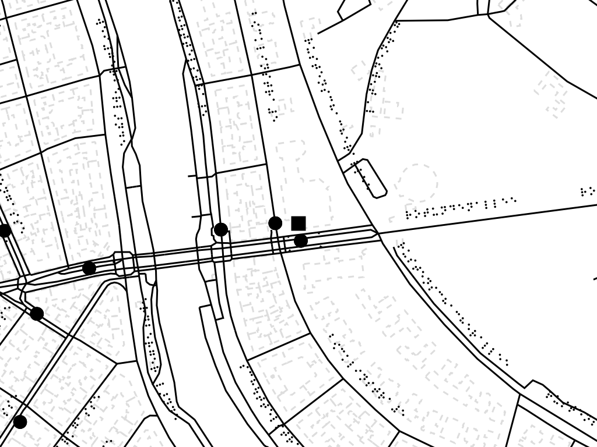

# osm2tactile
create tactile maps for visually impaired and blind people

a simple web service, generating maps, based on open street map data, using a braille font and suitable for embossed or swellpaper printing

## example map



road names are displayed in six point braille, building outlines are grey dashed lines. a black square is at the center of the map and black circles symobilze public transport stops.

### auto generated description for example map

#### following streets are on the map

- Böcklinstraße
- Erdberger Lände
- Halmgasse
- Hauptallee
- etc.

#### following points of interest are on the map

- Billa Schüttelstraße 39
- Bundes-Blindenerziehungsinstitut Wittelsbachstraße 5
- Litfasssäule Schüttelstraße
- Lotos Apotheke Wittelsbachstraße 4
- Museum des Blindenwesens Wittelsbachstraße 5
- etc.

## setup

### clone repo
```shell script
git clone https://github.com/raphiniert/osm2tactile.git
cd osm2tactile
```

### optional: create virtual enviornment

this step is only necessary when developing

```shell script
python3 -m venv venv
. venv/bin/activate
pip install pip --upgrade
pip install requirements-dev.txt
```

### create flask config

create the `instance/config.py` file and including relevant settings such as:
```python
SECRET_KEY = "your.super.secret.key"
DEBUG = True
TIMEZONE = "Europe/Vienna"
# postgres
POSTGRES_DB = "osm2tactile"
POSTGRES_USER = "postgres"
POSTGRES_PASSWORD = "your.super.secret.password"
POSTGRES_HOST = "db"

# nominatim
NOMINATIM_URL = "https://nominatim.openstreetmap.org"

# fonts
CUSTOM_FONT_PATH = "/srv/osm2tactile/osm2tactile/static/fonts"
```

### create .env file

```env
# docker compose
COMPOSE_PROJECT_NAME=osm2tactile
COMPOSE_FILE=docker-compose.yml

# postgres
POSTGRES_DB=osm2tactile
POSTGRES_USER=postgres
POSTGRES_PASSWORD=your.super.secret.password
POSTGRES_HOST=db
POSTGRES_PORT=5432

# flask
FLASK_APP=osm2tactile
FLASK_RUN_HOST=0.0.0.0
FLASK_ENV=development
```

### start (and build) containers

```shell script
docker compose up -d
```

### import data via osm2pgsql

download the osm data e. g. from https://download.geofabrik.de (using austria for the following examples) and move it to `data/osm/austria-latest.osm.pbf`

**note**: go grab yourself a coffe, the next step might take a while...

```shell script
docker compose exec flask osm2pgsql data/osm/austria-latest.osm.pbf -v --slim --database=osm2tactile --host=db --username=postgres --port=5432 --password
```

### download braille fonts

while importing the osm data, you could browse for some braille fonts and put the *.ttf files into `osm2tactile/static/fonts`. Exmaples can be found at the [Fernuni Hagen](https://www.fernuni-hagen.de/studium-sehgeschaedigte/studium/downloads.shtml)

### bonus points: self host nominatim

this project uses open street map's nominatim api. if you want to self host nominatim, it is not advised to use the same database for both, the tile server and nominatim. adding the following nominatim section to the `docker-compose.yml` will import the specified osm dump, setup a postres database with the postgis extension and starts an apache webserver on the specified port:

```yml
version: "3.9"

services:
  db:
    # ...
  flask:
    # ...
  nominatim:
    image: mediagis/nominatim:4.0
    ports:
        - "8080:8080"
    environment:
        # see https://github.com/mediagis/nominatim-docker/tree/master/4.0#configuration for more options
        PBF_URL: https://download.geofabrik.de/europe/austria-latest.osm.pbf
        REPLICATION_URL: https://download.geofabrik.de/europe/austria-updates/
        NOMINATIM_PASSWORD: very_secure_password
    volumes:
        - ./data/nominatim-data:/var/lib/postgresql/12/main
    shm_size: 1gb
    logging:
      driver: "json-file"
      options:
        max-size: "200m"
        max-file: "10"
    stdin_open: true
    tty: true
    restart: unless-stopped
```

You must also updated the nominatim url in the `instance/config.py` to your instance

```python
# nominatim
NOMINATIM_URL = "http://nominatim:8080"
```
